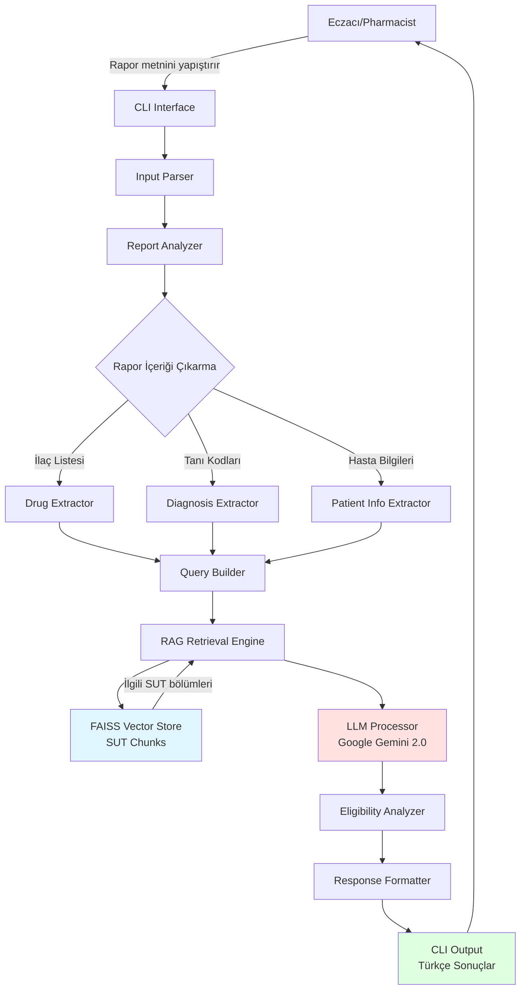
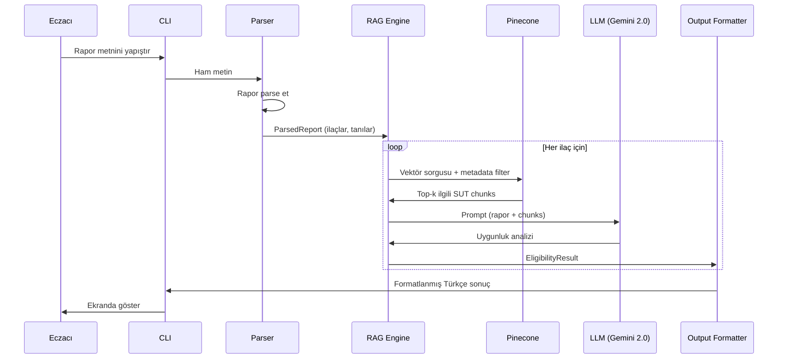

# Pharmacy Agent - SUT Compliance Checker

## Sistem Mimarisi ve Proje Dokümantasyonu

---

## 1. PROJE ÖZET

### 1.1 Problem Tanımı

Türk sağlık sistemi kapsamında, eczacılar hastalardan gelen reçetelerdeki ilaçların SGK (Sosyal Güvenlik Kurumu) tarafından karşılanıp karşılanmayacağını manuel olarak SUT (Sağlık Uygulama Tebliği) dokümanını kontrol ederek belirlemek zorundadır. Bu 15,000+ satırlık dokümanda arama yapmak çok zaman alıcıdır.

### 1.2 Çözüm

AI destekli bir ajan sistemi oluşturulacak:

- **Girdi**: Hastanın reçete raporu (metin formatında Ctrl+C/Ctrl+V ile)
- **İşlem**: RAG (Retrieval Augmented Generation) ile SUT dokümanında ilgili kuralları bulma
- **Çıktı**: Her ilaç için detaylı uygunluk analizi (Türkçe)

### 1.3 Teknoloji Stack

- **LLM**: Google Gemini 2.0 Flash (via OpenRouter)
- **Vector DB**: FAISS (Local, Fast, Accurate)
- **Framework**: Python
- **Interface**: CLI (MVP)

---

## 2. SİSTEM MİMARİSİ



---

```

---

## 3. DETAYLI BILEŞEN TASARIMI

### 3.1 Input Parser (Girdi İşleyici)

**Görev**: Ham rapor metnini işlenebilir yapıya dönüştürme

**Fonksiyonlar**:
```python
class InputParser:
    def parse_report(self, raw_text: str) -> ParsedReport
    def validate_input(self, raw_text: str) -> bool
    def clean_text(self, text: str) -> str
```

**Çıkarılacak Bilgiler**:


### 3.2 Report Analyzer (Rapor Analiz Motoru)

**Alt Modüller**:

#### 3.2.1 Drug Extractor

```python
class DrugExtractor:
    def extract_drugs(self, report: ParsedReport) -> List[Drug]

@dataclass
class Drug:
    kod: str                    # SGKF07
    etkin_madde: str           # EZETIMIB
    form: str                  # Ağızdan katı
    tedavi_sema: str          # Günde 1 x 1.0 Adet
    miktar: int               # 1
    eklenme_zamani: date      # 26/12/2024
```

#### 3.2.2 Diagnosis Extractor

```python
class DiagnosisExtractor:
    def extract_diagnoses(self, report: ParsedReport) -> List[Diagnosis]

@dataclass
class Diagnosis:
    icd10_code: str           # I25.1
    tanim: str                # Aterosklerotik Kalp Hastalığı
    baslangic: date
    bitis: date
```

#### 3.2.3 Patient Info Extractor

```python
class PatientInfoExtractor:
    def extract_patient_info(self, report: ParsedReport) -> PatientInfo

@dataclass
class PatientInfo:
    cinsiyet: str
    dogum_tarihi: date
    yas: int
    # Privacy: TC kimlik saklanmayacak
```

---

### 3.3 SUT Document Processing (Doküman İşleme)

**Chunking Stratejisi**: SUT dokümanı anlamlı bölümlere ayrılacak

```python
class SUTDocumentProcessor:
    def load_pdf(self, filepath: str) -> str
    def chunk_document(self, text: str) -> List[Chunk]
    def create_embeddings(self, chunks: List[Chunk]) -> List[Embedding]

@dataclass
class Chunk:
    chunk_id: str
    content: str
    metadata: ChunkMetadata
    start_line: int
    end_line: int

@dataclass
class ChunkMetadata:
    section: str              # "4.2.28" (madde numarası)
    topic: str                # "Lipid düşürücü ilaçlar"
    etkin_madde: List[str]    # ["ezetimib", "statin"]
    keywords: List[str]       # önemli terimler
    drug_related: bool
    has_conditions: bool
```

**Chunking Kuralları**:

1. **Madde bazlı**: Her madde (4.2.1, 4.2.2, vb.) ayrı chunk
2. **Overlap**: 100-200 karakter overlap (bağlam korunması için)
3. **Chunk Size**: 500-1000 token (Google Gemini için optimal)
4. **Metadata Enrichment**: Her chunk'a ilgili ilaç isimleri, tanı kodları eklenir

**Örnek Chunk**:

```text
Content: "4.2.28.C – Ezetimib içeren mono/kombine ürünler...
En az 6 ay boyunca statinlerle tedavi edilmiş olmasına rağmen..."

Metadata:
  section: "4.2.28.C"
  topic: "Ezetimib kullanım ilkeleri"
  etkin_madde: ["ezetimib", "statin"]
  keywords: ["LDL", "kardiyoloji", "uzman hekim raporu"]
  has_conditions: true
  start_line: 12528
  end_line: 12550
```

---

### 3.4 RAG Retrieval Engine

**FAISS Index Yapısı**:

```python
# Index Configuration
{
    "dimension": 1536,  # OpenAI text-embedding-3-small
    "index_type": "IndexFlatL2",  # Exact search for accuracy
    "metric": "L2",  # L2 distance (converted to similarity)
    "metadata": {
        "stored_fields": [
            "section",
            "etkin_madde",
            "drug_related",
            "has_conditions",
            "content"
        ]
    }
}
```

**Retrieval Stratejisi**:

```python
class RAGRetriever:
    def retrieve_relevant_chunks(
        self,
        query: str,
        drugs: List[Drug],
        filters: Dict
    ) -> List[RetrievedChunk]:
        """
        1. Her ilaç için ayrı sorgu oluştur
        2. Hybrid search: semantic + keyword filtering
        3. Top-k chunks getir (k=5-10)
        4. Re-ranking uygula (relevance score)
        """
        pass
```

**Query Construction**:

```python
# Örnek: Ezetimib için sorgu
query = f"""
İlaç: {drug.etkin_madde}
Tanı: {diagnosis.tanim} ({diagnosis.icd10_code})
Branş: {doctor.brans}
Hasta Yaşı: {patient.yas}
"""

# Metadata Filters
filters = {
    "etkin_madde": {"$in": ["ezetimib", "EZETIMIB"]},
    "drug_related": True
}
```

---

### 3.5 LLM Processor (OpenAI Integration)

**Prompt Engineering**:

```python
SYSTEM_PROMPT = """
Sen bir Türk sağlık sistemi uzmanısın. SUT (Sağlık Uygulama Tebliği) dokümantasyonuna
göre ilaçların SGK kapsamında olup olmadığını değerlendiriyorsun.

Görevin:
1. Verilen hasta raporu ve ilgili SUT bölümlerini analiz et
2. Her ilaç için uygunluk kriterlerini kontrol et
3. Detaylı ve anlaşılır Türkçe açıklama yap

Çıktı formatı:
- Emoji kullan (✅ uygun, ❌ uygun değil, ⚠️ koşullu)
- SUT madde numaralarını belirt
- Şartları açıkça listele
"""

USER_PROMPT_TEMPLATE = """
Hasta Raporu:
{report_content}

İlaç: {drug_name}
Tanı: {diagnosis}

İlgili SUT Bölümleri:
{retrieved_chunks}

Lütfen bu ilacın SGK kapsamında karşılanıp karşılanmayacağını değerlendir.
"""
```

---

### 3.6 Eligibility Analyzer (Uygunluk Değerlendirici)

**Değerlendirme Mantığı**:

```python
@dataclass
class EligibilityResult:
    drug_name: str
    status: Literal["ELIGIBLE", "NOT_ELIGIBLE", "CONDITIONAL"]
    confidence: float  # 0.0 - 1.0
    sut_reference: str  # "4.2.28.C (satır 12528-12550)"
    conditions: List[Condition]
    explanation: str  # Türkçe açıklama
    warnings: List[str]

@dataclass
class Condition:
    description: str
    is_met: Optional[bool]  # True/False/None (belirlenemedi)
    required_info: str  # Eksik bilgi varsa
```

**Örnek Çıktı**:
```text
✅ EZETIMIB - SGK KAPSAMINDA

SUT Referans: 4.2.28.C (satır 12528-12550)

Koşullar:
✅ En az 6 ay statin tedavisi gerekli
   → Raporda belirtilmiş: "Monoterapi ile kanbasıncı yeterli oranda kontrol altına alınamıştır"

⚠️ LDL düzeyi 100 mg/dL üzerinde olmalı
   → Raporda LDL değeri bulunamadı - eczacı doktora danışmalı

✅ Kardiyoloji/iç hastalıkları uzman raporu gerekli
   → Rapor kardiyoloji uzmanı tarafından düzenlenmiş (Dr. Bülent Uzunlar)

Özet: İlaç SGK kapsamında ancak LDL test sonucu doğrulanmalı.
```

---

## 4. VERİ AKIŞI

### 4.1 İşlem Adımları



### 4.2 Örnek Veri Dönüşümü

**1. Raw Input** (Eczacı yapıştırır):
```text
Rapor No: 277870
Hasta: ALİ KAYA
Tanı: I25.1 Aterosklerotik Kalp Hastalığı

İlaçlar:
SGKF07 EZETIMIB - Günde 1x1 Adet
SGKF05 METOPROLOL - Günde 1x1 Adet
```

**2. Parsed Structure**:
```json
{
  "report_id": "277870",
  "date": "26/12/2024",
  "hospital_code": "12415060",
  "doctor": {
    "name": "BÜLENT UZUNLAR",
    "specialty": "Kardiyoloji",
    "diploma": "89841"
  },
  "diagnoses": [
    {
      "code": "I25.1",
      "name": "Aterosklerotik Kalp Hastalığı",
      "start_date": "26/12/2024"
    }
  ],
  "drugs": [
    {
      "code": "SGKF07",
      "name": "EZETIMIB",
      "form": "Ağızdan katı",
      "dosage": "Günde 1 x 1.0 Adet"
    }
  ]
}
```

**3. Vector Query** (Her ilaç için):
```python
{
  "query_embedding": [0.123, -0.456, ...],  # embedding of query
  "filters": {
    "drug_related": True
  },
  "top_k": 10
}
```

**4. Retrieved Chunks** (FAISS'ten):
```python
[
  {
    "chunk_id": "sut_4_2_28_c",
    "content": "4.2.28.C – Ezetimib içeren mono/kombine ürünler...",
    "score": 0.89,
    "metadata": {
      "section": "4.2.28.C",
      "start_line": 12528,
      "end_line": 12550
    }
  }
]
```

**5. LLM Output**:
```json
{
  "drug_name": "EZETIMIB",
  "status": "CONDITIONAL",
  "confidence": 0.85,
  "sut_reference": "4.2.28.C (satır 12528-12550)",
  "conditions": [
    {
      "description": "En az 6 ay statin tedavisi almış olmalı",
      "is_met": null,
      "required_info": "Hasta geçmişinde statin kullanımı bilgisi"
    },
    {
      "description": "LDL düzeyi 100 mg/dL üzerinde olmalı",
      "is_met": null,
      "required_info": "LDL test sonucu"
    }
  ],
  "explanation": "Ezetimib SGK kapsamında ancak..."
}
```

---

## 5. TEKNIK DETAYLAR

### 5.1 FAISS Vector Database Setup

```python
from rag.faiss_store import FAISSVectorStore
from openai import OpenAI

# Initialize
vector_store = FAISSVectorStore()
client = OpenAI(api_key=OPENAI_API_KEY)

# Create index
vector_store.create_index(dimension=1536)

# Index SUT document
def index_sut_document(pdf_path: str):
    # 1. PDF → text
    text = extract_text_from_pdf(pdf_path)

    # 2. Chunk creation
    chunks = chunk_by_sections(text)

    # 3. Create embeddings
    embeddings_data = []
    for chunk in chunks:
        embedding = client.embeddings.create(
            model="text-embedding-3-small",
            input=chunk.content,
            encoding_format="float"
        )

        # 4. Prepare for FAISS
        embeddings_data.append({
            "id": chunk.chunk_id,
            "values": embedding.data[0].embedding,
            "metadata": {
                "content": chunk.content,
                "section": chunk.metadata.section,
                "etkin_madde": chunk.metadata.etkin_madde,
                "start_line": chunk.start_line,
                "end_line": chunk.end_line
            }
        })

    # 5. Add to FAISS and save
    vector_store.add_embeddings(embeddings_data)
    vector_store.save()
```

### 5.2 RAG Query Pipeline

```python
class RAGQueryPipeline:
    def __init__(self, vector_store: FAISSVectorStore, openai_client):
        self.vector_store = vector_store
        self.client = openai_client

    def query(self, drug: Drug, diagnosis: Diagnosis, patient: PatientInfo):
        # 1. Construct semantic query
        query_text = self._build_query_text(drug, diagnosis, patient)

        # 2. Get embedding
        query_embedding = self.client.embeddings.create(
            model="text-embedding-3-small",
            input=query_text
        ).data[0].embedding

        # 3. Search with metadata filters
        results = self.vector_store.search(
            query_embedding=query_embedding,
            top_k=10,
            filters={
                "drug_related": True
            }
        )

        # 4. Filter by drug name (manual filtering)
        drug_matches = [
            r for r in results
            if any(drug.etkin_madde.lower() in em.lower()
                   for em in r['metadata'].get('etkin_madde', []))
        ]

        # 5. Re-rank by relevance
        ranked_chunks = self._rerank(drug_matches if drug_matches else results)

        return ranked_chunks[:5]  # Top 5
```

### 5.3 LLM Eligibility Check

```python
class EligibilityChecker:
    def check_eligibility(
        self,
        drug: Drug,
        diagnosis: Diagnosis,
        patient: PatientInfo,
        sut_chunks: List[Chunk]
    ) -> EligibilityResult:

        # Construct prompt
        prompt = self._build_prompt(drug, diagnosis, patient, sut_chunks)

        # Call Google Gemini
        response = self.client.chat.completions.create(
            model="google/gemini-2.0-flash-001",
            messages=[
                {"role": "system", "content": SYSTEM_PROMPT},
                {"role": "user", "content": prompt}
            ],
            response_format={"type": "json_object"}
        )

        # Parse response
        result = json.loads(response.choices[0].message.content)

        return EligibilityResult(**result)
```

---

## 6. PROJE YAPISI

```text
pharmacy-agent/
│
├── README.md
├── requirements.txt
├── .env.example
├── .gitignore
│
├── data/
│   ├── 9.5.17229.pdf          # SUT document
│   └── sample_reports/         # Test için örnek raporlar
│       └── sample_1.txt
│
├── src/
│   ├── __init__.py
│   │
│   ├── config/
│   │   ├── __init__.py
│   │   └── settings.py         # API keys, config
│   │
│   ├── parsers/
│   │   ├── __init__.py
│   │   ├── input_parser.py     # Raw text → ParsedReport
│   │   ├── drug_extractor.py
│   │   ├── diagnosis_extractor.py
│   │   └── patient_extractor.py
│   │
│   ├── document_processing/
│   │   ├── __init__.py
│   │   ├── pdf_loader.py       # PDF → text
│   │   ├── chunker.py          # Text → chunks
│   │   ├── metadata_enricher.py
│   │   └── embeddings.py       # Chunks → vectors
│   │
│   ├── rag/
│   │   ├── __init__.py
│   │   ├── vector_store.py     # Pinecone operations
│   │   ├── retriever.py        # Query + retrieve
│   │   └── reranker.py         # Result re-ranking
│   │
│   ├── llm/
│   │   ├── __init__.py
│   │   ├── openai_client.py    # OpenAI API wrapper
│   │   ├── prompts.py          # Prompt templates
│   │   └── eligibility_checker.py
│   │
│   ├── models/
│   │   ├── __init__.py
│   │   ├── report.py           # Data classes
│   │   ├── drug.py
│   │   ├── diagnosis.py
│   │   └── eligibility.py
│   │
│   └── cli/
│       ├── __init__.py
│       └── main.py             # CLI interface
│
├── scripts/
│   ├── setup_faiss.py          # One-time: index SUT
│   ├── test_extraction.py      # Test parsers
│   └── evaluate_accuracy.py    # Accuracy testing
│
└── tests/
    ├── __init__.py
    ├── test_parsers.py
    ├── test_rag.py
    └── test_eligibility.py
```

---

## 7. IMPLEMENTATION PHASES

### Phase 1: Setup & Document Processing (Week 1)

- [x] Setup project structure
- [x] Install dependencies (openai, faiss-cpu, PyPDF2)
- [x] Extract text from 9.5.17229.pdf
- [x] Implement chunking strategy
- [x] Create embeddings
- [x] Index to FAISS

### Phase 2: Report Parsing (Week 1-2)
- [ ] Build InputParser
- [ ] Extract drugs from report
- [ ] Extract diagnoses (ICD-10 codes)
- [ ] Extract patient & doctor info
- [ ] Unit tests for parsers

### Phase 3: RAG System (Week 2)
- [ ] Implement RAGRetriever
- [ ] Query construction logic
- [ ] Metadata filtering
- [ ] Test retrieval accuracy

### Phase 4: LLM Integration (Week 2-3)
- [ ] OpenAI API integration
- [ ] Prompt engineering
- [ ] EligibilityChecker implementation
- [ ] JSON response parsing

### Phase 5: CLI Interface (Week 3)
- [ ] Build CLI with input/output
- [ ] Format Turkish output
- [ ] Add colored output (rich library)
- [ ] User-friendly error messages

### Phase 6: Testing & Validation (Week 3-4)
- [ ] Test with real patient reports
- [ ] Validate against manual SUT checks
- [ ] Measure accuracy
- [ ] Refine prompts

---

## 8. KEY DEPENDENCIES

```txt
# requirements.txt
openai>=1.0.0
faiss-cpu>=1.7.4
numpy>=1.24.0
python-dotenv>=1.0.0
PyPDF2>=3.0.0
pydantic>=2.0.0
rich>=13.0.0          # CLI formatting
langchain>=0.1.0      # Optional: for advanced RAG
tiktoken>=0.5.0       # Token counting
```

---

## 9. CONFIGURATION

```python
# .env.example
OPENAI_API_KEY=sk-...

# Model settings
EMBEDDING_MODEL=text-embedding-3-small
LLM_MODEL=google/gemini-2.0-flash-001
CHUNK_SIZE=1000
CHUNK_OVERLAP=200
TOP_K_CHUNKS=5

# Language
OUTPUT_LANGUAGE=turkish
```

---

## 10. ÖRNEK KULLANIM (CLI)

```bash
$ python -m src.cli.main

╔══════════════════════════════════════════════════════════╗
║          ECZANE SUT UYGUNLUK KONTROLÜ                   ║
║          Pharmacy SGK Eligibility Checker                ║
╚══════════════════════════════════════════════════════════╝

Hasta raporunu yapıştırın (Ctrl+V) ve Enter'a basın:
[Ctrl+D ile bitirin]

> [Eczacı raporu yapıştırır]

Analiz ediliyor... ⏳

╔══════════════════════════════════════════════════════════╗
║ RAPOR ANALİZ SONUÇLARI                                   ║
╚══════════════════════════════════════════════════════════╝

📋 Rapor Bilgileri:
  • Rapor No: 277870
  • Tarih: 26/12/2024
  • Doktor: Dr. Bülent Uzunlar (Kardiyoloji)
  • Tanı: I25.1 - Aterosklerotik Kalp Hastalığı

━━━━━━━━━━━━━━━━━━━━━━━━━━━━━━━━━━━━━━━━━━━━━━━━━━

💊 İLAÇ ANALİZİ (5 ilaç bulundu)

1️⃣  KLOPIDOGREL HIDROJEN SULFAT
    ✅ SGK KAPSAMINDA KARŞILANIR

    📖 SUT Referans: Madde 4.2.15.A (satır 11177-11191)

    ✅ Koşullar Sağlanıyor:
       • Koroner arter hastalığı mevcut
       • Kardiyoloji uzmanı raporu var
       • Kullanım süresi belirtilmiş (12 ay)

    ℹ️  Not: Tedavi süresi 12 ay geçmemeli

━━━━━━━━━━━━━━━━━━━━━━━━━━━━━━━━━━━━━━━━━━━━━━━━━━

2️⃣  METOPROLOL
    ✅ SGK KAPSAMINDA KARŞILANIR

    📖 Rapor şartı yok, tüm hekimler reçete edebilir

━━━━━━━━━━━━━━━━━━━━━━━━━━━━━━━━━━━━━━━━━━━━━━━━━━

3️⃣  EZETIMIB
    ⚠️  KOŞULLU - EK BİLGİ GEREKİYOR

    📖 SUT Referans: Madde 4.2.28.C (satır 12528-12550)

    ✅ Sağlanan koşullar:
       • Kardiyoloji uzman raporu mevcut

    ⚠️  Eksik bilgiler:
       • LDL düzeyi 100 mg/dL üzerinde olmalı
         → Raporda LDL test sonucu yok
       • En az 6 ay statin tedavisi gerekli
         → Raporda statin kullanım geçmişi belirtilmemiş

    💡 Öneri: Hastanın LDL test sonucunu ve statin
       tedavi geçmişini doktordan talep edin

━━━━━━━━━━━━━━━━━━━━━━━━━━━━━━━━━━━━━━━━━━━━━━━━━━

Raporu PDF olarak kaydet? (e/h): _
```

---

## 11. ACCURACY & PERFORMANCE

### 11.1 Accuracy Metrics
- **Target Accuracy**: >95% (kritik sağlık uygulaması)
- **Measurement**: Manuel SUT kontrolü ile karşılaştırma
- **Edge Cases**: Belirsiz durumlar için "DOKTORA DANIŞIN" önerisi

### 11.2 Performance Targets
- **Response Time**: <10 saniye (5 ilaç için)
- **Cost per Query**: ~$0.005-0.01 (GPT-5-mini + embedding)
- **Throughput**: 100+ sorgu/saat

### 11.3 Error Handling
```python
class SUTCheckerError(Exception):
    """Base exception"""

class ReportParsingError(SUTCheckerError):
    """Rapor parse edilemedi"""

class DrugNotFoundError(SUTCheckerError):
    """İlaç SUT'ta bulunamadı"""

class FAISSIndexError(SUTCheckerError):
    """FAISS index hatası"""
```

---

## 12. GÜVENLİK & PRİVACY

### 12.1 Data Privacy
- ✅ **TC Kimlik numaraları** saklanmaz
- ✅ **Hasta isimleri** loglarda yer almaz
- ✅ **API calls** encryption ile (HTTPS)
- ✅ **Local processing** öncelikli

### 12.2 Data Retention
- Sorgu geçmişi saklanmaz (stateless)
- Vector DB sadece SUT dokümanı içerir
- Log files hasta bilgisi içermez

---

## 13. FUTURE ENHANCEMENTS

### Phase 2 (Web Interface)
- Flask/FastAPI backend
- React frontend
- File upload for report images (OCR)
- Multi-user support

### Phase 3 (Advanced Features)
- PDF rapor yükleme (OCR ile)
- Tarihsel analiz (ilaç uygunluk değişimleri)
- Alternatif ilaç önerileri
- SUT güncellemeleri otomatik takip

### Phase 4 (Enterprise)
- Multi-eczane deployment
- Analytics dashboard
- Admin panel (SUT güncelleme)
- Mobile app

---

## 14. TESTING STRATEGY

### 14.1 Unit Tests
```python
def test_drug_extraction():
    report = """
    SGKF07 EZETIMIB Ağızdan katı Günde 1 x 1.0
    """
    drugs = DrugExtractor().extract_drugs(report)
    assert drugs[0].etkin_madde == "EZETIMIB"

def test_sut_retrieval():
    query = "ezetimib kardiyoloji raporu"
    chunks = retriever.retrieve(query, top_k=5)
    assert "4.2.28" in chunks[0].metadata.section
```

### 14.2 Integration Tests
```python
def test_end_to_end():
    # Gerçek rapor + SUT
    report = load_sample_report("sample_1.txt")
    results = sut_checker.check_report(report)

    # Doğrulama
    assert results[0].drug_name == "EZETIMIB"
    assert results[0].status in ["ELIGIBLE", "NOT_ELIGIBLE", "CONDITIONAL"]
```

### 14.3 Accuracy Validation
- 50+ gerçek hasta raporu ile test
- Deneyimli eczacı ile karşılaştırma
- False positive/negative oranı <5%

---

## 15. DEPLOYMENT

### MVP Deployment
```bash
# Local CLI
git clone <repo>
cd pharmacy-agent
pip install -r requirements.txt
cp .env.example .env
# Edit .env with API keys

# Index SUT document (one-time)
python scripts/setup_faiss.py

# Run CLI
python -m src.cli.main
```

### Production Considerations
- Docker containerization
- API rate limiting
- Caching frequent queries
- Monitoring & logging (Sentry)

---

## 16. COST ESTIMATION

### Per Query (5 ilaç):
- **Embeddings**: 5 queries × $0.0001 = $0.0005
- **FAISS**: $0 (local, free!)
- **GPT-5-mini**: ~2000 tokens × $0.0025/1K = $0.005
- **Total**: ~$0.02 per report

### Monthly (1000 rapor):
- **Total Cost**: $20-30 (only OpenAI, FAISS is free!)
- **Very affordable** for single pharmacy
- **FAISS saves**: ~$100-200/month vs cloud vector DBs

---

## 17. RISKS & MITIGATIONS

| Risk | Impact | Mitigation |
|------|--------|------------|
| LLM hallucination (yanlış bilgi) | HIGH | Confidence score + "Doktora danış" fallback |
| SUT format değişimi | MEDIUM | Modular chunking + easy re-indexing |
| API downtime | MEDIUM | Graceful error handling + retry logic |
| Privacy breach | HIGH | No PII storage + encryption |
| Slow response | LOW | Caching + optimized prompts |

---

## 18. SUCCESS METRICS

### MVP Success Criteria:
- ✅ 10 test raporunda >90% accuracy
- ✅ <10 saniye response time
- ✅ Türkçe output quality (readable)
- ✅ Zero false negatives (critical drugs)

### Production Ready:
- ✅ 100+ test raporunda >95% accuracy
- ✅ Web interface deployed
- ✅ 5+ eczane kullanımında
- ✅ Documented API

---

## 19. NEXT STEPS

### Immediate (This Week)

1. ✅ Requirements gathering - DONE
2. ✅ Architecture design - IN PROGRESS
3. ⏳ Get approval on architecture
4. ⏳ Setup development environment

### Week 1

- Implement PDF processing
- Build chunking logic
- Index to Pinecone
- Test retrieval

### Week 2

- Build parsers
- Integrate OpenAI
- End-to-end testing
- CLI interface

---

## 20. SORULAR VE KARARLAR

### Açık Sorular

1. ❓ SUT dokümantasyonu ne sıklıkla güncellenir?
2. ❓ Kaç eczacı kullanacak (multi-user gerekli mi)?
3. ❓ Reçete görüntüsü (foto) yükleme lazım mı (OCR)?
4. ❓ Sonuçları PDF'e aktarma özelliği?

### Teknik Kararlar

- ✅ OpenAI (GPT-5-mini) kullan - En iyi Türkçe desteği
- ✅ Pinecone - Managed, kolay setup
- ✅ CLI MVP - Hızlı test için
- ✅ Chunk size: 1000 token - Optimal balance

---

## CONTACT & SUPPORT

**Developer**: [Your Name]
**Project Start**: January 2025
**Status**: Architecture Design Phase
